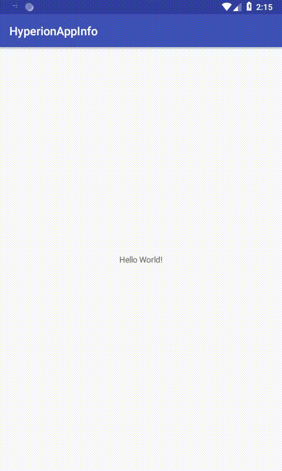

# Hyperion AppInfo

[](https://search.maven.org/artifact/com.star-zero/hyperion-appinfo)

[Hyperion-Android](https://github.com/willowtreeapps/Hyperion-Android) Plugin to show screen of details about an application



## Usage

Add dependencies to `build.gradle`.

```groovy
dependencies {
	debugImplementation "com.willowtreeapps.hyperion:hyperion-core:$hyperion_version"
	debugImplementation "com.star-zero:hyperion-appinfo:$plugin_latest_version"
}
```

## License

MIT License

